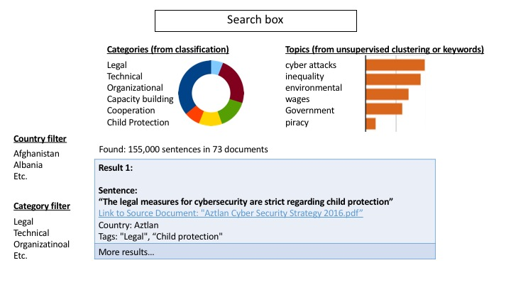

# CyberSecurity_Strategies
Machine-based Text Analytics of CyberSecurity Strategies

The cybersecurity strategies can be downloaded from this website from the International Telecommunications Union:

[National Cybersecurity Strategies repository](http://www.itu.int/en/ITU-D/Cybersecurity/Pages/National-Strategies-repository.aspx)

Here you can see a human analysis of cyberscurity laws. It would be interesting to see whether a similar analysis per country could be done using machine-learning or other text mining techniques:

[Cyberwellness Profiles](http://www.itu.int/en/ITU-D/Cybersecurity/Pages/Country_Profiles.aspx)

## Suggested analysis

###Text mining

- Create a text version of each of the 73 cybersecurity strategy documents at the link above
- Break down each document into sentences
- Classify each sentence and try to assign it a tag from this list below. It is expected that each document will have hundreds or thousands of sentences tagged and many sentences which can't be tagged because they are note related to any of the tags below.

**These labels come from the headers in the cyberwellness profiles linked above**

| Category               | Sub category |
|------------------------| -------------|
|LEGAL MEASURES          | CRIMINAL LEGISLATION, REGULATION AND COMPLIANCE|
|TECHNICAL MEASURES      | CIRT, STANDARDS, CERTIFICATION|
|ORGANIZATION MEASURES   | POLICY, ROADMAP FOR GOVERNANCE, RESPONSIBLE AGENCY, NATIONAL BENCHMARKING|
|CAPACITY BUILDING       | STANDARDISATION DEVELOPMENT, MANPOWER DEVELOPMENT, PROFESSIONAL CERTIFICATION, AGENCY CERTIFICATION|
|COOPERATION             | INTRA-STATE COOPERATION, INTRA-AGENCY COOPERATION, PUBLIC SECTOR PARTNERSHIP,  INTERNATIONAL COOPERATION|
|CHILD ONLINE PROTECTION | NATIONAL LEGISLATION,  UN CONVENTION AND PROTOCOL, INSTITUTIONAL SUPPORT, REPORTING MECHANISM|

>For example, let's classify a sentence from imaginary country "Aztlan":
>"This country has implemented strict criminal legislation and certification of technology specialists for cybersecurity"

- A suggested schema to store this sentence after the analysis is: (suggested json or yaml format):
```
Sentence id number: 10384648   # A unique number to identify this sentence  
Source Document: "Aztlan Cyber Security Strategy 2016.pdf"   # the name of the .pdf where the sentence comes from  
Country: "Aztlan"  
Sentence: "This country has implemented strict criminal legislation and certification of technology specialists for cybersecurity"  
Classification Tags: "Legal - Criminal legislation", "Technical measures - certification"  # from classification process  
Topics or keywords: "children, attacks, green computing, denial of service, etc"  # from unsupervised topic discovery  
Sentence Position in Document: page #, or byte   (this is so then we can link to the sentence)  
```

### Search (optional but very useful)
If you used a search engine for any of the steps above this information is unnecessary to you, but if you did not, keep reading:
- If the thousands of sentences in the documents could be ingested into an Apache Solr or Elastic Search server they could be easily searched by the end-users with their specific queries.

### Unsupervised topic extraction (optional but useful)
If you can also do an unsupervised analysis to extract the topics of the sentences, this would also be useful. This would show that there might be some important topics which do not fit in any of the classification categories of the table above.


## Expected result
After all your efforts above, the expected product is a web page where end-users can interact with the data. The webpage should include:

- A visualization where the user can graphically explore the dataset
- It must include an area where the user can read the tagged sentences
- It must have buttons or check boxes to filter the sentences displayed (Country, Source Document, Tags). Multiple filters should be allowed simultaneously. (E.g. Filter by country and by 2 tags)
- Ideally the users shuld be able to query the dataset freely.

For example this could be a reulting dashboard, but please don't limit your creativity to this:  


## Software and hardware requirements / recommendations

- Web interface: it is recommended the web interface uses only static html, javascript and css files. In this way the hosting can be done moved around easily without dependencies on php, pyhton, java, etc. Suggested frameworks include:   http://vuejs.org/ , https://facebook.github.io/react/, https://angularjs.org/

- Backend or database: as above, if possible do not create any dependency on a database or search server for serving the application. It is suggested that you use database or search engine servers for processing the data, but the result ideally will all be saved in static files (json, csv, yaml, xml, etc.) which can be stored and served from many hosting environment.

- If your organization has servers with long-term life and support you might want to use these as a backend, but your organization must be committed to offering the service for at least five years.

### Examples (demos and code)

**Includes a search engine and a rich visualization** https://unite.un.org/ideas/content/whs-explorer
**Text analysis offline and just created a visualization of the results**
https://unite.un.org/ideas/content/links-sustainable-cities
